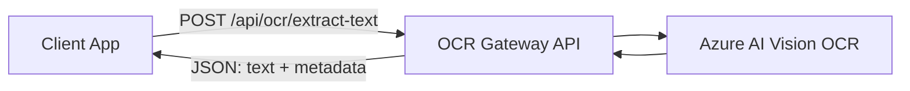

# Azure OCR Gateway API

A small, focused service that turns **images into usable text** by wrapping **Azure AI Vision OCR** behind a simple REST API.

> **In one sentence:**  
> Upload an image (or give us a URL), get back clean, structured text you can plug into your systems.

---

## Who is this for?

> **If you're a business stakeholder…**

- You have **documents, invoices, forms, IDs, labels, or receipts** coming in as images or scans.
- People are **re-typing** information into spreadsheets, CRMs, or billing systems.
- You’d like to **automate** that capture while staying on a modern, cloud-native platform (Azure).

This API gives your teams a **consistent, secure entry point** for OCR, so you can:

- Reduce **manual data entry** and errors.
- Build **workflow automation** (e.g., invoice approval, identity checks, claims intake).
- Keep using Azure’s AI capabilities without every team re-implementing Azure integration.

> **If you're a developer…**

- You get a clean Node.js / Express API.
- It supports **image URLs** and **file uploads**.
- Input validation, error handling, and a **stable JSON response** are already handled for you.
- Under the hood, it uses the official Azure Image Analysis client:  
  `@azure-rest/ai-vision-image-analysis` with `AzureKeyCredential`.

---

## High-level value

- ✅ **Single front door for OCR** across teams and apps.
- ✅ **Abstracts Azure Vision details** into a stable, documented contract.
- ✅ **Consistent error handling and logging** so ops teams can monitor and troubleshoot.
- ✅ Easy to extend with **auth, rate limiting, and additional Vision features** later.

---

## Quick view (for the impatient)



**Call pattern:**

- `POST /api/ocr/extract-text`
  - Provide either:
    - `imageUrl` in JSON **OR**
    - `file` in `multipart/form-data`

  - Optional flags like `language`, `includeBoundingPolygons`, `includeRawReadResult`.

You’ll find full request/response details in
👉 [`docs/API-Reference.md`](docs/API-Reference.md)

---

## Getting started (developers)

1. **Clone the repo & install**

   ```bash
   git clone <repo-url> azure-ocr-gateway
   cd azure-ocr-gateway
   npm install
   ```

2. **Configure environment**

   Copy and update `.env`:

   ```bash
   cp .env.example .env
   ```

   In `.env`, set:

   ```bash
   PORT=3000
   VISION_ENDPOINT=https://<your-azure-vision-resource>.cognitiveservices.azure.com
   VISION_KEY=<your-azure-vision-key>
   MAX_UPLOAD_SIZE_MB=4
   ```

3. **Run locally**

   ```bash
   npm run dev  # with nodemon
   # or
   npm start
   ```

4. **Quick health check**

   ```bash
   curl http://localhost:3000/health
   # -> { "status": "ok", "timestamp": "..." }
   ```

5. **First OCR call**

   ```bash
   curl -X POST http://localhost:3000/api/ocr/extract-text \
     -H "Content-Type: application/json" \
     -d '{
       "imageUrl": "https://example.com/document.png",
       "language": "en",
       "includeBoundingPolygons": false
     }'
   ```

---

## Documentation map

This project is **documentation-oriented**. Start where it makes sense for you:

- 📚 **Overview (business + tech)**
  [`docs/Overview.md`](docs/Overview.md)

- 💻 **Developer onboarding**
  [`docs/Getting-Started.md`](docs/Getting-Started.md)

- 🔍 **Full API details**
  [`docs/API-Reference.md`](docs/API-Reference.md)

- 🧱 **Architecture & design decisions**
  [`docs/Architecture-and-Design.md`](docs/Architecture-and-Design.md)

- 📂 **Bruno request collection for manual testing**
  [`docs/Bruno.md`](docs/Bruno.md)

- ❓ **Frequently asked questions**
  [`docs/FAQ.md`](docs/FAQ.md)

---

## Tech stack at a glance

- **Runtime:** Node.js (24.11.0+)
- **Framework:** Express
- **Key packages:**
  - `@azure-rest/ai-vision-image-analysis` – official Azure Image Analysis REST client for OCR
  - `@azure/core-auth` – `AzureKeyCredential` for authenticating with the Vision endpoint
  - `multer` – handles image file uploads
  - `zod` – input & config validation
  - `helmet`, `cors`, `morgan` – security, CORS, logging
