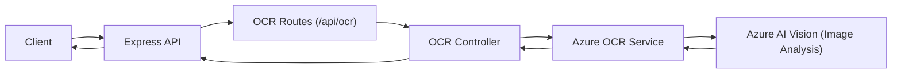

# Architecture & Design

This document explains how the service is structured and why certain decisions were made.

---

## 1. High-level diagram

---

## 2. Key components

- **Express app (`src/app.js`)**
  - Configures middleware: JSON parsing, CORS, security headers, logging.
  - Registers routes under `/api/ocr`.

- **Routes (`src/routes/ocrRoutes.js`)**
  - `POST /extract-text`
  - Uses:
    - `multer` to handle image file uploads.
    - `validateBody` to validate JSON payloads via Zod schemas.

- **Controller (`src/controllers/ocrController.js`)**
  - Reads validated input (`req.validatedBody`).
  - Handles presence of `imageUrl` vs `file`.
  - Calls `azureOcrService.analyzeImage(...)`.
  - Shapes the final response (`source`, `ocr`).

- **Service (`src/services/azureOcrService.js`)**
  - Uses the official Azure Image Analysis REST client:
    - `@azure-rest/ai-vision-image-analysis`
    - `AzureKeyCredential` from `@azure/core-auth`

  - Knows how to call Azure Vision’s Image Analysis **Read** feature.
  - Deals with:
    - Choosing the right content type depending on image source (URL vs binary).
    - Mapping the SDK’s `readResult` into:
      - `plainText`
      - `lines` (with words, confidence, optional polygons)
      - `metadata`, `modelVersion`

  - Wraps Azure client responses into consistent application errors.

- **Validation (`src/validation/ocrSchemas.js`, `src/config/config.js`)**
  - **Env config** is validated at startup (Zod).
  - **Request bodies** are validated per endpoint (Zod) before reaching the controller.

- **Error handling (`src/middlewares/errorHandler.js`)**
  - Centralised error formatting.
  - Special cases:
    - Malformed JSON
    - Too-large file uploads
    - Unsupported file types
    - Azure errors (with safe diagnostics)

---

## 3. Async & scalability considerations

- All Azure calls are **async** via the Azure REST client.
- A small asyncHandler wrapper is used in the routes so that any rejected promise or thrown error inside async route handlers is forwarded to the central error handler.
- Stateless by design:
  - No in-memory storage of OCR results.
  - Scales horizontally (multiple instances behind a load balancer).

To scale:

- Run multiple instances (e.g. containers) behind your API gateway.
- Add caching layers at the API gateway level if you repeatedly process the same URLs.

---

## 4. Validation & edge-case handling

**Request validation:**

- Zod schemas ensure:
  - `imageUrl` (if present) is a valid URL.
  - `language` is a short string.
  - Booleans are parsed or rejected appropriately.

**Image input edge cases:**

- **Both `imageUrl` and `file` missing** → `400 MISSING_IMAGE`.
- **Non-image file** → `400 UNSUPPORTED_MEDIA_TYPE`.
- **File too large** → `413 FILE_TOO_LARGE`.

**Azure integration edge cases:**

- Network / client-level issues:
  - The Azure REST client may throw for connectivity problems (DNS, connection failures, etc.).
  - The gateway wraps those as `AZURE_CLIENT_ERROR` with HTTP `502`, signalling an upstream dependency problem.

- Azure 4xx/5xx:
  - The service wraps these as `AZURE_VISION_ERROR`.
  - Actual Azure error code and message are available in `error.details`.

---

## 5. Security considerations

- **Secrets**:
  - `VISION_KEY` is read from `.env` and never logged or returned.
  - Ensure your deployment platform manages secrets securely (Key Vault, secret manager, etc.).

- **Transport**:
  - For production, host behind **HTTPS**.
  - When calling Azure, the SDK uses HTTPS by default.

- **Headers & CORS**:
  - `helmet` adds security headers (XSS, frame options, etc.).
  - `cors` can be configured to restrict allowed origins to trusted clients.

- **Future enhancements** (recommended):
  - Auth:
    - API key or JWT middleware.
    - Integration with an API Gateway or Azure API Management.

  - Rate limiting:
    - Protects against abusive or accidental over-usage.

---

## 6. Extensibility

The design keeps concerns separated so you can:

- Add new endpoints (e.g. `/analyze-layout`, `/caption-image`) by:
  - Creating a new controller.
  - Adding a new route.
  - Reusing or extending `azureOcrService`.

- Swap implementation details:
  - Replace `logger` with a structured logger (e.g., Winston, Pino).
  - Introduce tracing (OpenTelemetry, Application Insights).
  - Plug in feature flags / A/B testing at the service layer.

---

## 7. Testing strategy (suggested)

You can add tests at several levels:

- **Unit tests**:
  - `azureOcrService.extractLinesFromReadResult` — ensure text extraction & flattening works as expected.
  - Validation schemas — ensure bad inputs are rejected.

- **Integration tests**:
  - Call `/api/ocr/extract-text` with a known image and assert on the shape of the response (mock Azure or use a test resource).

- **Smoke tests**:
  - Simple health check and a basic OCR call in CI before deployments.
